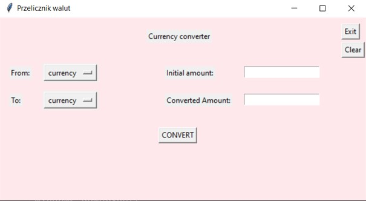
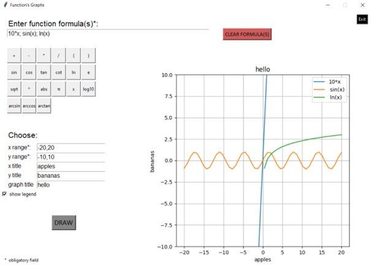

# Python Tkinter Projects

## Author: Julia Grzegorzewska

## Table of contents
- [Description](#Description)
- [Language](#Language)
- [Libraries](#Libraries)
- [How to run](#How-to-run)

## Description
Projects for academic course at Wrocław University of Science and Technology using Tkinter library to make GUI.

**CurrencyConverter** 

Program for currency conversion based on actual rates from NBP Web page. If internet connection is not available last rates are saved in actual_rates.txt file. GUI interface includes:
- selection of currencies from drop-down list
- textbox to enter the money amount
- result display
- button to run the program
- button to end the program

**DrawFunctions** 

Program to draw function plots. GUI interface includes:
- place to type function formula
- buttons with mathematical symbols, operators and elementary functions
- place to type plot title and labels
- optional legend
- button to run the program
- button to end the program
- plotting many plots together

Documentation of the program was done using **pydoc**. 

## Language
- **Python 3.9.0**

## Libraries
- [tkinter](https://docs.python.org/3/library/tkinter.html)
- [urllib.request](https://docs.python.org/3/library/urllib.request.html)
- [requests](https://pypi.org/project/requests/)
- [json](https://docs.python.org/3/library/json.html)
- [sys](https://docs.python.org/3/library/sys.html)
- [pydoc](https://docs.python.org/3/library/pydoc.html)
- [re](https://docs.python.org/3/library/re.html)
- [numpy](https://numpy.org/)
- [matplotlib](https://matplotlib.org/)

## How to run

**CurrencyConverter** 
1. Clone the project: \
`git clone  https://github.com/grzesiaaa/Python_TkinterProjects.git Python_TkinterProjects`
2. Go to folder with the app: \
`cd Python_TkinterProjects` \
`cd CurrencyConverter`
3. Run the converter: \
`python interface.py`

**DrawFunctions**
1. Clone the project: \
`git clone  https://github.com/grzesiaaa/Python_TkinterProjects.git Python_TkinterProjects`
2. Go to folder with the app: \
`cd Python_TkinterProjects` \
`cd DrawFunctions` 
3. Run the app: \
`python draw_function.py`

## How it looks?
Some screenshots of GUIs. 

\
\
